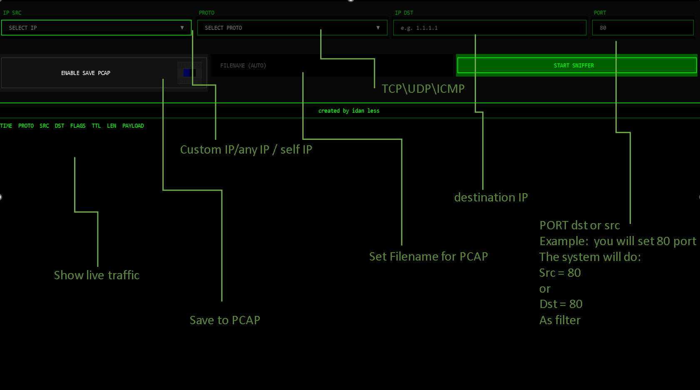

# Network Packet Sniffer

Based on my old tcpdump : [tcpdump-windows-10](https://github.com/idanless/tcpdump-windows-10)
Download Py2Exe as single file :  [singlefile Py2exe](https://github.com/idanless/wintcpdump/releases/download/network/wintcpdump.zip) #download and run


  

A network traffic analyzer that captures and displays packets in real-time. It's basically tcpdump for Windows but with a visual interface. Small, portable, and doesn't need installation - just 13MB total.



## What it does

Monitor network traffic on your Windows machine. Filter by IP addresses, protocols, and ports. Watch packets in real-time as they pass through your network. Save everything to PCAP files that you can open in Wireshark later.

If you've used tcpdump on Linux, this is similar but with an interface that's easier to work with.

## Features

- Real-time packet capture and display
- Filter by source/destination IP, protocol (TCP/UDP/ICMP), and port
- TCP flag monitoring - see SYN, ACK, FIN, RST packets
- Payload preview showing first 30 bytes
- Export to PCAP format
- Clean terminal interface with color coding
- Automatic file naming so you don't overwrite old captures
- Completely portable - runs from USB drive
- Only 13MB total size
- No registry changes or system modifications

## Requirements

- Windows (uses WinDivert driver)
- Python 3.7 or newer
- Administrator privileges - needed for packet capture

## Installation

Install the required packages:

```bash
pip install pydivert textual
```

You also need the WinDivert driver. Put `WinDivert64.dll` (or `WinDivert.dll` for 32-bit) in either:
- A `pydivert` subfolder next to the script
- The same directory as the script

## Usage

Run with administrator privileges:

```bash
python wintcpdump.py
```

### Interface Controls

| Control | Description |
|---------|-------------|
| **IP SRC** | Filter by source IP - choose from your local IPs or type a custom one |
| **PROTO** | Select protocol - TCP, UDP, ICMP, or any |
| **IP DST** | Filter by destination IP address |
| **PORT** | Filter by specific port number |
| **ENABLE SAVE PCAP** | Toggle saving to file |
| **FILENAME** | Choose output filename - auto-generates if you leave it empty |

Click START SNIFFER to begin, STOP SNIFFER to halt.

### Filter Examples

| What you want | How to set it up |
|---------------|------------------|
| Monitor all traffic from your machine | Select your local IP in IP SRC |
| Capture HTTP traffic | Set PROTO to TCP, PORT to 80 |
| Watch DNS queries | Set PROTO to UDP, PORT to 53 |
| Track traffic to a specific server | Enter the IP in IP DST field |
| Monitor HTTPS connections | Set PROTO to TCP, PORT to 443 |
| Capture SSH traffic | Set PROTO to TCP, PORT to 22 |

## Output Format

The packet table shows:

| Column | What it means |
|--------|---------------|
| **TIME** | When the packet was captured |
| **PROTO** | Protocol type - TCP, UDP, or ICMP |
| **SRC** | Source IP and port |
| **DST** | Destination IP and port |
| **FLAGS** | TCP flags if applicable |
| **TTL** | Time to live value |
| **LEN** | Packet length in bytes |
| **PAYLOAD** | First 30 bytes of payload - only printable characters shown |

## Why it's portable

This tool is designed to be fully portable:

- Copy the folder to a USB drive
- Run from any Windows machine that you have admin rights on
- No registry modifications
- No system-wide installation needed
- All dependencies bundled in 13MB

Good for network admins who need a diagnostic tool they can carry around.

## Comparison with tcpdump

| Feature | tcpdump (Linux) | This Tool (Windows) |
|---------|----------------|---------------------|
| Platform | Linux/Unix | Windows |
| Interface | Command line | Terminal UI |
| Size | Around 1MB | Around 13MB |
| Filtering | Command line arguments | Visual dropdown menus |
| Output | PCAP files | Live view plus PCAP files |

## Important notes

- You need admin/elevated privileges to access the network driver
- Large capture sessions might slow things down
- PCAP files work with Wireshark and similar tools
- The tool uses sniff mode so it won't mess with your normal traffic
- Good for quick network diagnostics without installing heavy tools

## Troubleshooting

**Driver error on startup:** Make sure you're running as administrator and the WinDivert DLL is in the right location.

**No packets showing up:** Check your filter settings. Try "ANY IP" and "ANY PROTO" first to make sure capture is working.

**Can't save file:** Check that you have write permissions in the script directory.

**Running slow:** Reduce your filter scope or turn off PCAP saving for better speed.


## License

This is a network monitoring tool for educational purposes and legitimate network administration. Make sure you have permission to monitor network traffic before using it.

---

*A portable tcpdump alternative for Windows*
